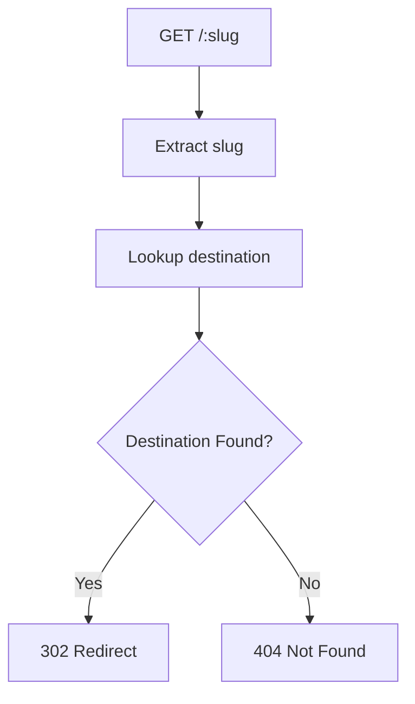
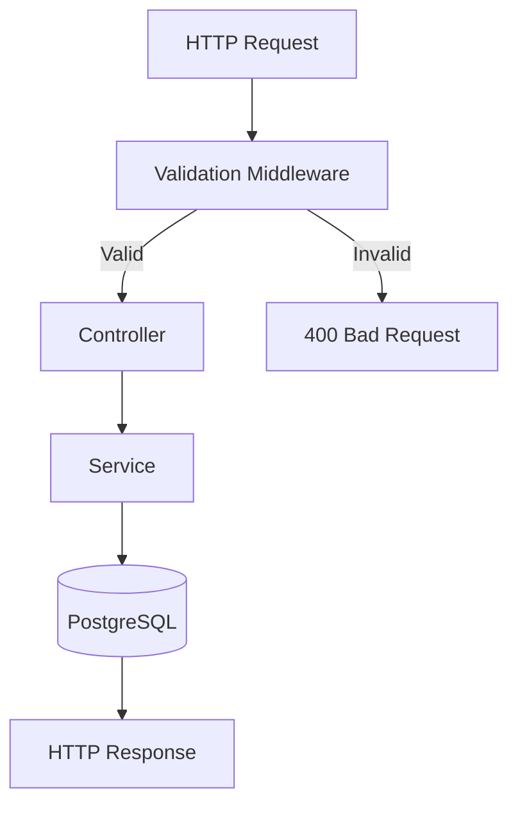
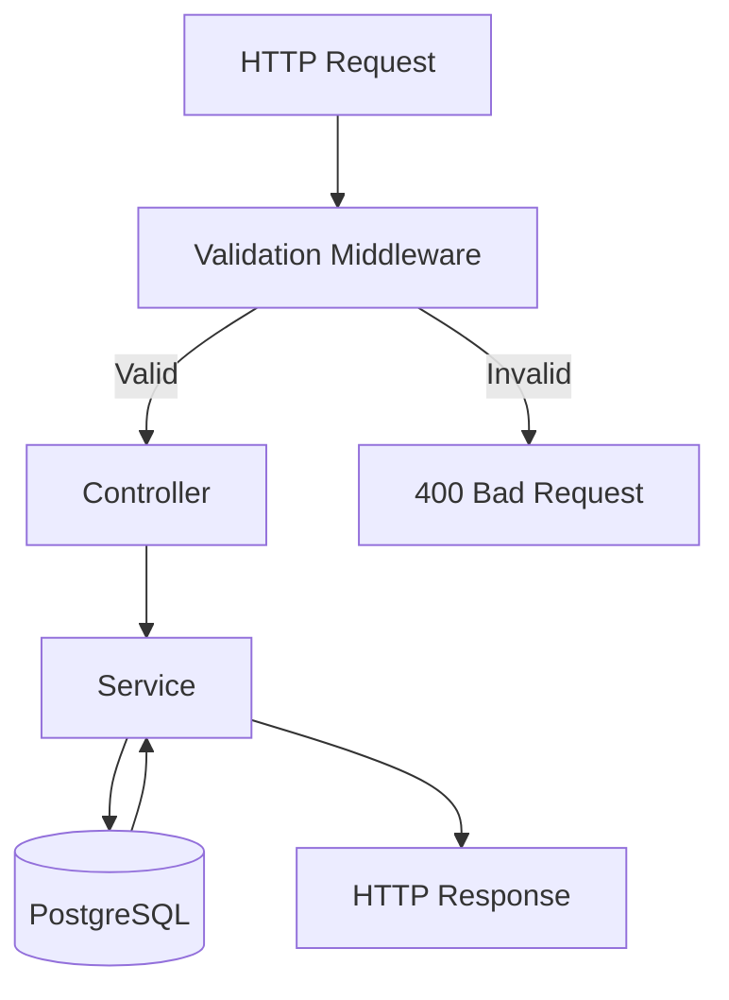

# OwnLink

[](https://www.typescriptlang.org/)
[](https://nodejs.org/)
[](https://expressjs.com/)
[](https://www.postgresql.org/)

> A backend-first URL redirection platform exploring user-owned redirects through modern backend architecture.

OwnLink is a backend-first URL redirection platform that explores how modern redirect infrastructure can be designed with scalability, maintainability, and user ownership in mind.

The project is developed incrementally to explore production backend engineering concepts—including API design, layered architecture, database design, validation, and TypeScript—while laying the foundation for a platform that prioritizes portable, user-owned redirects.

Although the long-term vision includes authentication, analytics, QR code generation, custom domains, and self-hosting, the current focus is building a robust backend foundation before introducing higher-level features.

---

# Why OwnLink?

Many dynamic QR code platforms create vendor lock-in.

Businesses print QR codes on menus, posters, packaging, or advertisements because the destination behind the code can be updated later without reprinting.

The downside is ownership.

If a subscription expires or a provider shuts down, those QR codes may stop working, forcing businesses to continue paying simply to preserve redirects they already created.

OwnLink explores a different approach.

The long-term goal is to build redirect infrastructure where users own their redirects. Instead of competing through lock-in, OwnLink aims to support portability through features such as exports, self-hosting, and migration tools.

This repository focuses on building the engineering foundation required to support that vision.

---

# Features

## Feature Summary

| Capability | Description | Status |
|------------|-------------|--------|
| CRUD API | Manage redirect links | ✅ |
| Redirect Engine | Resolve short links to destinations | ✅ |
| PostgreSQL Persistence | Persistent storage with database constraints | ✅ |
| DBMate Migrations | Version-controlled schema changes | ✅ |
| Automatic Slug Generation | Server-generated immutable slugs | ✅ |
| Request Validation | Zod validation at the HTTP boundary | ✅ |
| Layered Architecture | Controller → Service → Database | ✅ |
| Error Handling | Centralized application errors | ✅ |
| Security | Helmet and API hardening | ✅ |

## Link Management

OwnLink currently provides a REST API for managing redirect links.

Supported operations include:

* Create new links
* Retrieve a single link
* Retrieve all links
* Update existing links
* Delete links

### Automatic Slug Generation

Clients never provide a slug.

Instead, the backend automatically generates a unique short slug for every new link and transparently retries if a collision occurs.

This keeps the API simple while ensuring slug uniqueness remains a server-side responsibility.

Example request:

```http
POST /links
```

```json
{
  "destinationUrl": "https://google.com"
}
```

Example response:

```json
{
  "id": 1,
  "slug": "Ab3X9kQ",
  "destinationUrl": "https://google.com"
}
```

Updating a link only requires changing the destination URL.

```http
PATCH /links/Ab3X9kQ
```

```json
{
  "destinationUrl": "https://google.ai"
}
```

Slugs are immutable after creation.

---

## Redirect Engine

Redirect users using a short slug.

Current flow:



---

## Request Validation

Incoming requests are validated using **Zod** before reaching the controller layer.

Current request flow:



Validation provides:

* Validation at the HTTP boundary
* Reusable request schemas
* Type-safe request bodies using `z.infer`
* Consistent HTTP 400 responses
* Controllers receive validated data only

---

## PostgreSQL Persistence

OwnLink uses PostgreSQL as its primary datastore.

Current schema includes:

* Identity primary key
* Unique slug constraint
* CHECK constraints preventing blank slugs
* CHECK constraints preventing blank destination URLs

The project intentionally relies on PostgreSQL to enforce data integrity instead of duplicating database validation inside application code.

---

## Database Migrations

The project uses **DBMate** to version and manage database schema changes.

Every schema modification is recorded as a migration, allowing the database to evolve without recreating it or losing existing data.

Common commands:

```bash
pnpm db:new <migration_name>
pnpm db:up
pnpm db:down
pnpm db:status
pnpm db:dump
```

Each migration contains an **up** section that applies the change and a corresponding **down** section that rolls it back.

The generated `schema.sql` file represents the latest database schema and is committed alongside migration files.

---

## Layered Architecture

OwnLink follows a layered architecture that separates HTTP concerns, business logic, validation, and persistence.



Each layer has a single responsibility:

| Layer | Responsibility |
|--------|----------------|
| Validation | Validate incoming requests |
| Controller | Handle HTTP requests and responses |
| Service | Business logic and orchestration |
| PostgreSQL | Persistent storage and data integrity |
| Error Handler | Convert application errors into HTTP responses |

---

## Database Error Handling

Infrastructure-specific database errors are translated into application-level HTTP errors.

Examples include:

* Empty destination URL → **400 Bad Request**
* Missing resource → **404 Not Found**
* Slug generation exhausted after retry limit → **500 Internal Server Error**

This keeps PostgreSQL implementation details isolated from the rest of the application.

---

## Data Integrity

Data integrity is enforced primarily at the database layer.

Current safeguards include:

* Identity primary key
* Unique slugs
* Non-empty slug validation
* Non-empty destination URL validation

Application code focuses on business rules while PostgreSQL guarantees data consistency.

---

# Tech Stack

## Backend

- Node.js
- Express 5
- TypeScript

## Database

- PostgreSQL
- postgres.js
- DBMate

## Validation & Security

- Zod
- Helmet

## Tooling

- pnpm
- Git
- GitHub
- ESLint
- Prettier
- TSX

---

# Project Structure

```text
backend/
├── db/
│   ├── migrations/
│   └── schema.sql
├── src/
│   ├── controllers/
│   ├── db/
│   ├── errors/
│   ├── middleware/
│   ├── routes/
│   ├── schemas/
│   ├── services/
│   ├── utils/
│   ├── app.ts
│   └── server.ts
├── package.json
└── tsconfig.json
```

---

### Folder Responsibilities

| Folder | Responsibility |
|----------|----------------|
| `controllers/` | Handle HTTP requests and responses |
| `services/` | Contain business logic |
| `middleware/` | Cross-cutting concerns such as validation and error handling |
| `schemas/` | Zod request validation schemas |
| `db/` | Database access and connection management |
| `errors/` | Custom application errors |
| `utils/` | Shared utilities and helper functions |

---

# API Endpoints

| Method | Endpoint       | Description              |
| ------ | -------------- | ------------------------ |
| GET    | `/links`       | Retrieve all links       |
| GET    | `/links/:slug` | Retrieve a single link   |
| POST   | `/links`       | Create a new short link  |
| PATCH  | `/links/:slug` | Update destination URL   |
| DELETE | `/links/:slug` | Delete a link            |
| GET    | `/:slug`       | Redirect to destination  |

---

# Design Principles

The current implementation is guided by several architectural principles:

- PostgreSQL is the source of truth for data integrity.
- Request validation happens at the HTTP boundary.
- Slugs are generated exclusively by the server.
- Business logic is isolated from transport concerns.
- Infrastructure-specific errors are translated into application-level errors.
- Controllers remain lightweight and focused on HTTP.
- Database naming conventions remain independent from application models through SQL aliases.

---

# Getting Started

Create a `.env` file:

```env
DATABASE_URL=your_database_url
PORT=3000
```

Go into backend folder:

```bash
cd OwnLink/backend
```

Install dependencies:

```bash
pnpm install
```

Apply migrations:

```bash
pnpm db:up
```

Start the development server:

```bash
pnpm run dev
```

Build:

```bash
pnpm run build
```

Run ESLint:

```bash
pnpm run lint
```

Format the project:

```bash
pnpm run format
```

---

# Roadmap

## Completed

- Express server setup
- Redirect engine
- CRUD operations
- Service layer architecture
- PostgreSQL integration
- Database migrations with DBMate
- Configuration management
- Request validation with Zod
- Automatic server-side slug generation
- Layered architecture
- Centralized error handling
- API hardening
- Helmet security headers
- TypeScript migration
- GitHub workflow

## Next

- Automated testing
- Request logging improvements
- CI/CD pipeline
- Docker support

## Future

- User authentication
- User-owned links
- Analytics
- QR code generation
- Custom domains
- Role-based authorization
- Export/import tools
- Self-hosted deployment

---

# Learning Goals

OwnLink is intentionally developed incrementally.

Rather than implementing every planned feature immediately, each milestone focuses on a specific backend engineering concept.

Areas currently explored include:

- API design
- Layered architecture
- Database design
- Request validation
- Error handling
- Configuration management
- Security
- TypeScript best practices
- Maintainable backend development

The goal is to understand why production systems are designed the way they are while gradually evolving OwnLink into a fully featured redirect platform.

